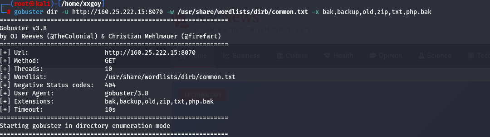
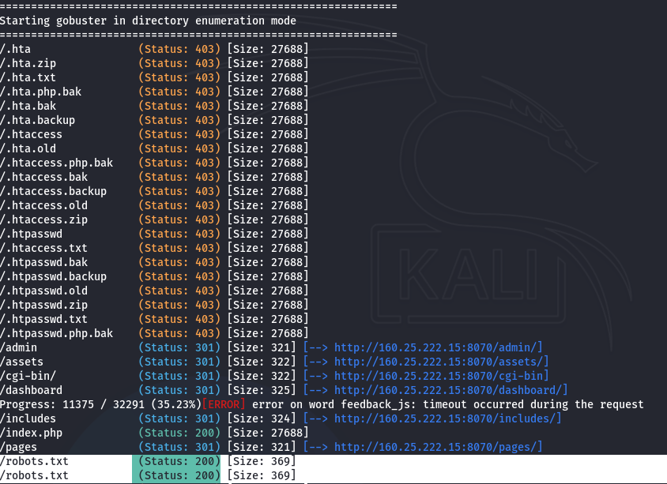
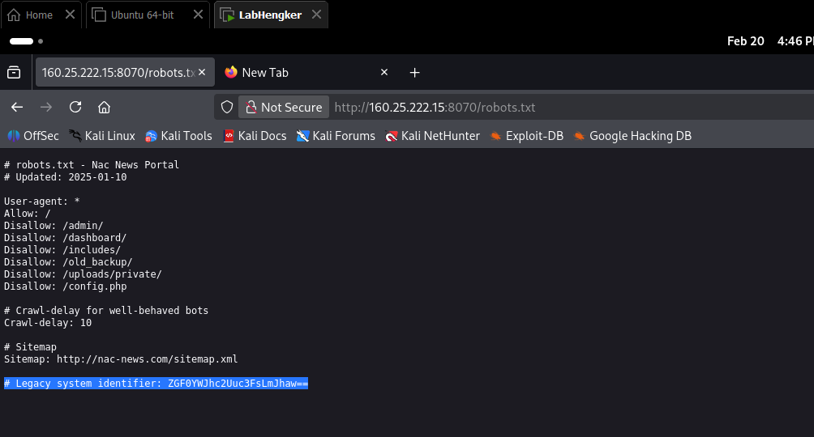
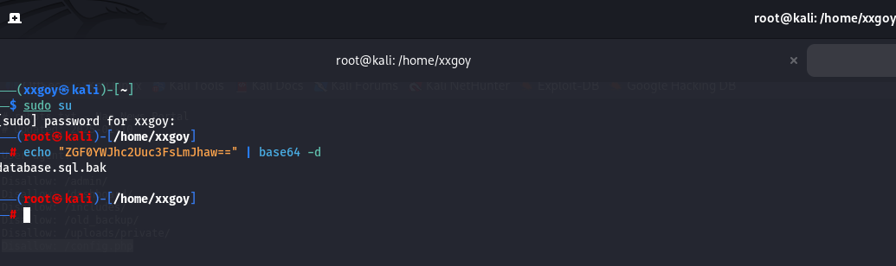
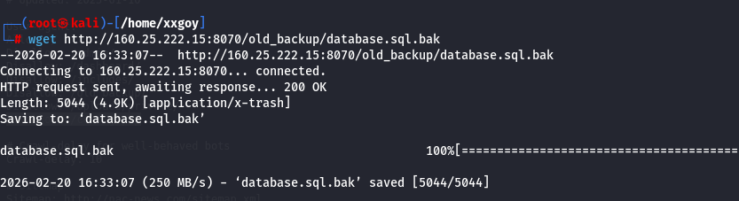
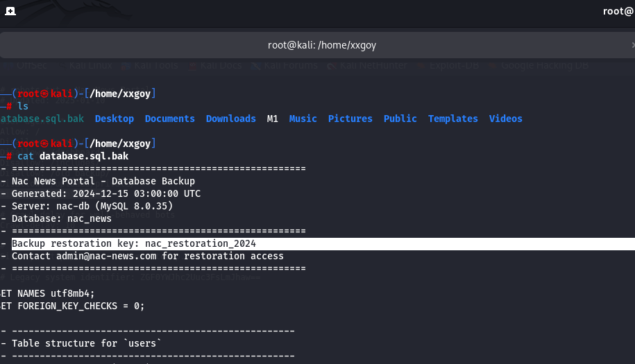
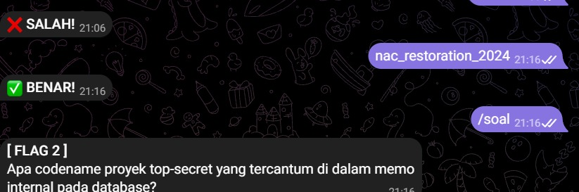
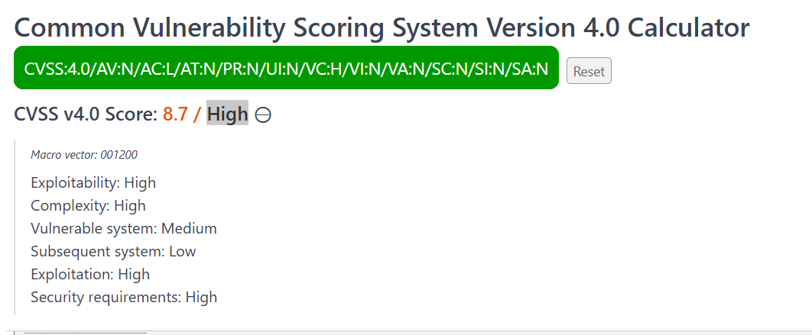

# FLAG [1]: Exposed Backup Restoration Key

### Description
Apa restoration key yang tersimpan di dalam file backup lama pada website ini?

### Hint
💡 Hint: Common File, Encode

### Analysis
Kami memulai penetrasi dengan melakukan enumerasi direktori menggunakan `gobuster` untuk memetakan *path* yang ada di dalam server target. Hasilnya menunjukkan adanya file `robots.txt`. Dari inspeksi file tersebut, kami menemukan direktori *backup* tersembunyi dan sebuah *string* Base64. Setelah di-*decode*, *string* tersebut merujuk pada nama file *backup*. Kami kemudian mengunduh file tersebut dan membaca isinya untuk mendapatkan kunci restorasi.

### Solution
**1. Scanning Direktori (Gobuster)**

Kami menjalankan *tools* `gobuster` di terminal untuk mencari file dan direktori tersembunyi menggunakan *wordlist* `common.txt` dengan tambahan ekstensi spesifik:
`gobuster dir -u http://160.25.222.15:8070 -w /usr/share/wordlists/dirb/common.txt -x bak,backup,old,zip,txt,php.bak`

Hasil menunjukkan bahwa target memiliki file `/robots.txt` yang dapat diakses secara publik (Status: 200).

**2. Membuka url robots.txt**

Kami membuka URL `http://160.25.222.15:8070/robots.txt` melalui *browser* pada port yang terbuka. Di dalam file tersebut, terdapat *path* `/old_backup/` yang disembunyikan dari mesin pencari (Disallow) dan sebuah komentar berisi *Legacy system identifier* dalam bentuk Base64: `ZGF0YWJhc2Uuc3FsLmJhaw==`.

**3. Decoding Base64**

Melalui terminal Kali Linux, kami melakukan *decoding* pada *string* Base64 tersebut menggunakan perintah `echo`. Hasilnya mengarah pada nama file *backup database*, yaitu `database.sql.bak`.

**4. Mengunduh File Backup (Data Extraction)**

Menggabungkan informasi direktori `/old_backup/` dan file `database.sql.bak`, kami menggunakan perintah `wget` untuk mengunduh arsip tersebut dari server ke perangkat lokal kami.

**5. Membaca database.sql.bak**

Terakhir, kami membaca isi file SQL yang berhasil diunduh menggunakan perintah `cat database.sql.bak`. Di bagian *header* file tersebut, kami langsung menemukan *Backup restoration key* yang menjadi target kami.

**🚩 Bukti Flag Benar:**

---

### Vulnerability Assessment
* **Vulnerability:** Information Disclosure / Sensitive Data Exposure
* **Severity:** High
* **CVSS v4.0 Score:** **8.7 (High)**
* **CVSS Vector:** `CVSS:4.0/AV:N/AC:L/AT:N/PR:N/UI:N/VC:H/VI:N/VA:N/SC:N/SI:N/SA:N`

### Saran Rekomendasi Mitigasi
1. **Pindahkan File Sensitif:** Segera hapus atau pindahkan direktori `/old_backup/` beserta file `database.sql.bak` ke luar dari *web root directory* (misal: di luar `/var/www/html/`) agar tidak dapat diakses langsung melalui URL publik.
2. **Hindari Security by Obscurity:** Jangan menggunakan file `robots.txt` untuk menyembunyikan direktori atau file sensitif. File ini ditujukan untuk mesin pencari, namun justru sering dijadikan target utama enumerasi oleh *attacker*.
3. **Hapus Komentar Sensitif:** Pastikan tidak ada komentar yang mengandung kredensial, *identifier* sistem, atau *hint* yang disandikan (seperti Base64) di dalam *source code* atau file publik seperti `robots.txt`.
