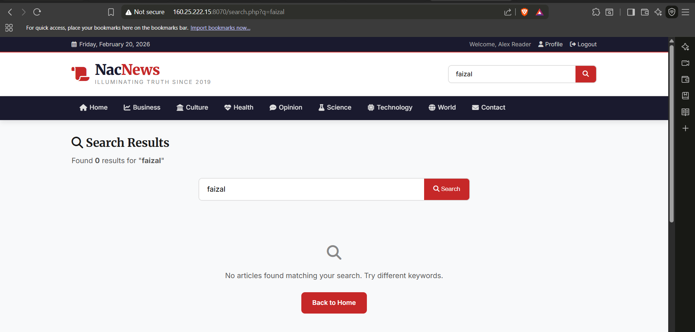
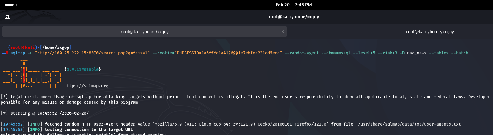
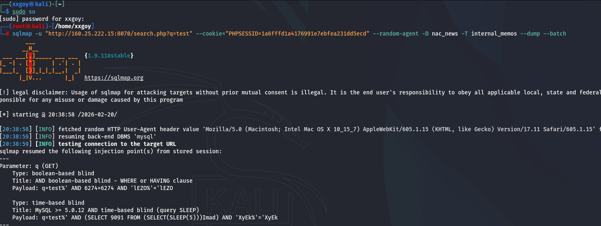
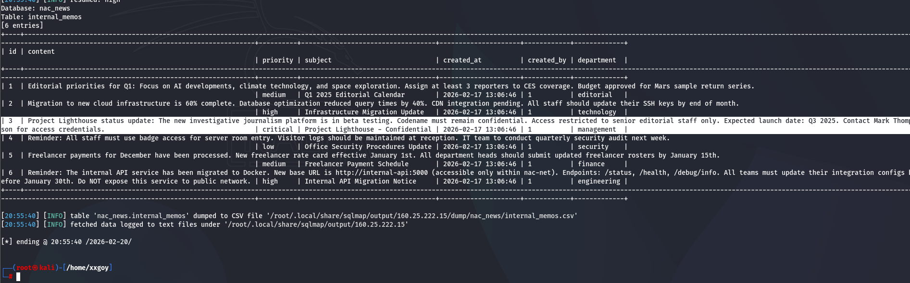
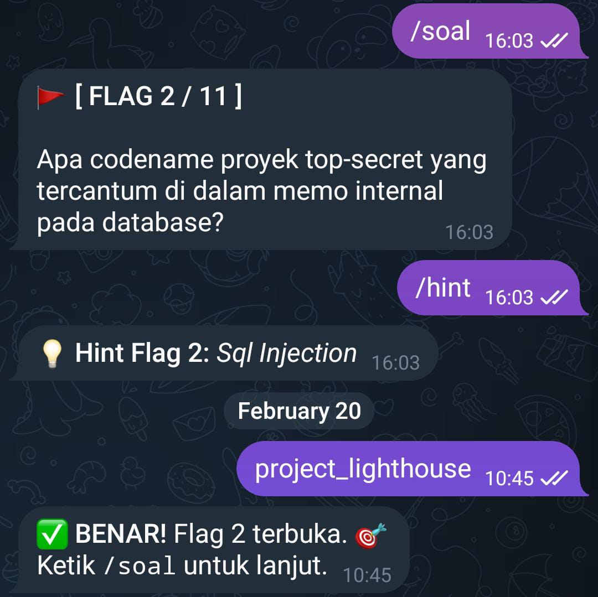

# FLAG [2]: Top-Secret Project Codename

### Description
Apa codename proyek top-secret yang tercantum di dalam memo internal pada database?

### Hint
💡 Hint: Sql Injection

### Analysis
Setelah berhasil masuk ke web NacNews menggunakan kredensial *user* standar (Alex Reader), kami mulai memetakan semua titik *input* yang memungkinkan interaksi dengan *backend*. Perhatian kami langsung tertuju pada fitur pencarian artikel yang menggunakan *endpoint* `search.php?q=`. 

Kami berasumsi bahwa *input* dari parameter `q` ini diteruskan langsung ke dalam eksekusi *query* SQL database. Lewat beberapa tes manual (*fuzzing*), aplikasi terlihat menelan *input* kami mentah-mentah tanpa adanya mekanisme pembersihan (sanitasi) yang memadai. Karena celah ini bersifat *blind* (error database tidak dimunculkan di layar), kami memutuskan untuk mengotomatisasi serangan menggunakan **SQLMap**. Tantangannya, kami harus menjaga sesi agar tetap "login" selama SQLMap bekerja, jika tidak, server akan terus memblokir *request* kami.

### Solution
**1. Identifikasi Titik Injeksi (Injection Point)**
Kami menemukan bahwa kolom pencarian pada URL `http://160.25.222.15:8070/search.php?q=` berpotensi rentan dan menjadi titik masuk utama eksploitasi.

**2. Pengambilan Session Cookie**

Untuk mencegah pemblokiran dari server karena status *unauthorized*, kami mengambil *session cookie* (`PHPSESSID`) milik akun yang sedang *login* melalui tab *Application* / *Storage* pada *Developer Tools* di browser.

**3. Scan Tables**

Menggunakan terminal Kali Linux, kami menjalankan `sqlmap` dengan menyertakan parameter rentan dan *cookie* tersebut. Karena server memiliki proteksi, kami menaikkan level dan risiko pemindaian (`--level=5 --risk=3`) serta menetapkan DBMS ke MySQL untuk mengekstrak struktur tabel database.

**4. Hasil Scan Tables**

Hasil scanning agresif tersebut berhasil menjebol struktur database dan memetakan 13 tabel di dalam database nac_news. Berdasarkan deskripsi tantangan yang mencari "memo internal", kami mengidentifikasi tabel internal_memos sebagai target utama untuk dibongkar.

**5. Scan Internal Memos**

Langkah selanjutnya adalah mengekstrak (dump) seluruh isi dari tabel internal_memos tersebut ke perangkat lokal menggunakan perintah berikut:

**6. Hasil Internal Memos**

Proses dumping memunculkan beberapa baris entri data. Pada tabel dengan ID 3, kami menemukan memo dengan prioritas critical bersubjek Project Lighthouse - Confidential. Di dalam kolom content, tertulis dengan jelas instruksi bahwa nama proyek (codename) tersebut dijaga ketat agar tetap rahasia.

**Bukti Flag Benar:**

---

### Vulnerability Assessment
* **Vulnerability:** SQL Injection (Boolean-based / Time-based Blind)
* **Severity:** High
* **CVSS v4.0 Score:** **7.1 (High)**
* **CVSS Vector:** `CVSS:4.0/AV:N/AC:L/AT:N/PR:L/UI:N/VC:H/VI:N/VA:N/SC:N/SI:N/SA:N`

### Saran Rekomendasi Mitigasi
1. **Gunakan Prepared Statements (Parameterized Queries):** Ini adalah pertahanan paling efektif. Pastikan *query* pencarian di-*backend* dipisahkan dari input pengguna, sehingga database menganggap input tersebut murni sebagai string data, bukan sebagai perintah eksekusi (SQL).
2. **Validasi dan Sanitasi Input:** Terapkan filter yang ketat pada kolom pencarian. Tolak karakter khusus (seperti tanda kutip tunggal `'`, titik koma `;`, atau *dash* ganda `--`) yang sering digunakan untuk memanipulasi struktur SQL.
3. **Prinsip Hak Akses Minimum (Least Privilege):** Konfigurasikan akun database yang digunakan oleh aplikasi web agar hanya memiliki hak akses baca/tulis ke tabel yang diperlukan (seperti `articles`). Aplikasi web publik tidak seharusnya memiliki hak akses untuk membaca tabel internal seperti `internal_memos`.
4. **Implementasikan WAF (Web Application Firewall):** Gunakan WAF untuk mendeteksi dan memblokir *payload* injeksi otomatis dari *tools* seperti `sqlmap` sebelum mencapai *server* aplikasi.
